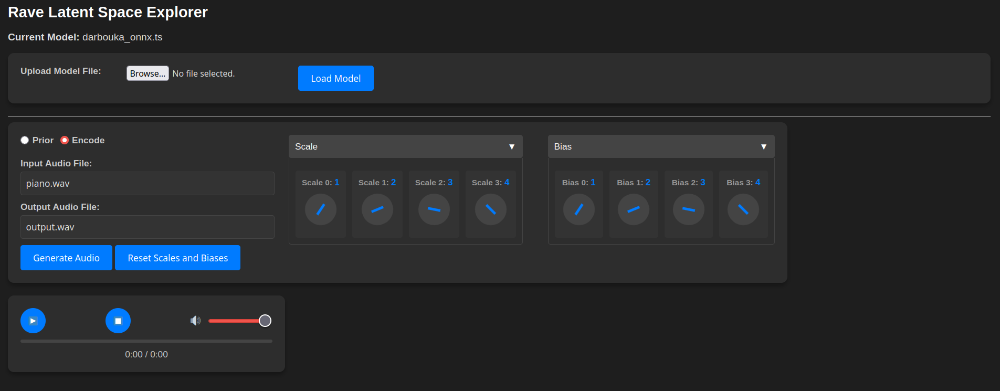

# RAVE Latent Space Explorer



## Requirements

Create and activate a venv

```bash
pip install -r requirements.txt
```

## Usage

### 1. Generate Audio from Prior Distribution

```bash
python generate.py --model path/to/model.ts --mode prior --duration 5 --temperature 0.8 --output_file /path/to/output.wav
```

This command will generate audio based on the prior distribution using the
provided model. By default, the scale and bias values will be applied as `[1.0] * latent_size`
and `[0.0] * latent_size` respectively.

### 2. Encode and Decode an Audio File

```bash
python generate.py --model path/to/model.ts --mode encode --input_file path/to/input.wav --output_file /path/to/output.wav
```

This command will encode an input audio file and decode it back to audio using the provided model.

3. Custom Scale and Bias for Latent Space

You can specify custom scale and bias values for manipulating the latent space representation. These values must match the latent dimension of the model

```bash
python generate.py --model path/to/model.ts --mode prior --duration 5 --temperature 0.8 --scale 1.0 1.2 1.5 --bias 0.0 0.1 0.2 --output_file /path/to/output.wav
```

In this command, the scale and bias values are provided as lists of floating-point numbers, and they will be applied to the latent space

## User Interface

In addition to the command-line interface, the script can also be run
with a Flask-based web interface. This interface provides a user-friendly way
to interact with the model and tweak parameters without needing to use the
command line.

1. Run the Flask app

```bash
flask run
```

2. Access the User Interface: Open your browser and navigate to the URL where the server is running (http://127.0.0.1:5000/). 

## Notes

- The script assumes a target sample rate of 48 kHz.
- If the input file is not mono, it will be converted to mono.
- Resampling is handled automatically if needed.
- Ensure that the number of scale and bias values matches the latent dimension of the model. If not, the script will exit with an error.
